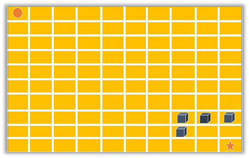
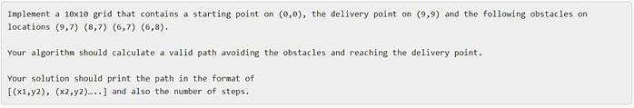
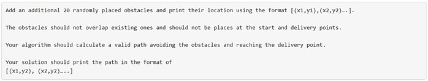
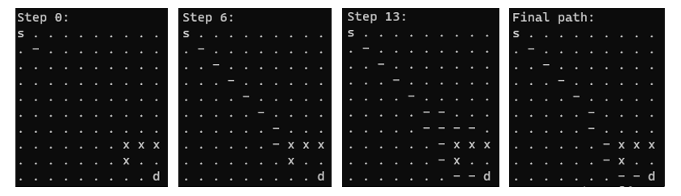
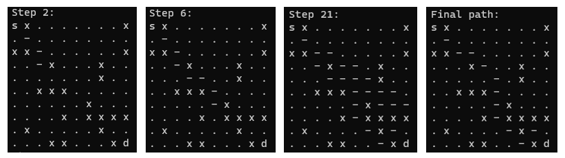

# A pathfinding algorithm for self-driving delivery vehicles
Amazon's Coding Challenge for Bright Network (Internship Experience - UK).

## Task description
The self-driving vehicle will need to create a path on a 2D-grid that contains a starting point (x,y), a delivery point (x,y) and a number of obstacles. Your vehicle can navigate to any of the adjacent squares (even diagonally), as long as the squares are inbound and do not contain an obstacle.



### Phase 1:


### Pase 2:


## Method
An implement of A* Algorithm:
- G is the step needed to reach current state/position
- H is the estimated distance between the current and goal position
- F is the cost estimation (G + H) 

Find the minimum F of all reachable positions in each step.

## Usage
Please run following commands: 
```bash
python pathfinding_algorithm_phase_1.py
python pathfinding_algorithm_phase_2.py
```

## Algorithm visualization

### Phase 1: (4 obstacles)


### Phase 2: (20 randomly obstacles)



#### Note:
`'-'`: Predicted path
`'x'`: Obstacles
`'s'`: Starting point
`'d'`: Delivery point